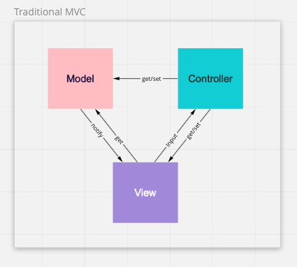
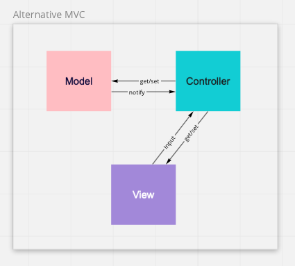

# Model-View-Controller (MVC)

## What

This pattern has been defined as a design pattern or an architectural pattern. It's based on three types of classes that help build user interfaces:

- **The model:** contains the application logic and data
- **The view:** what is presented in the screen for a user
- **The controler:** defines the logic that helps the application respond to user input

## Why

The use of the MVC pattern helps decouple the code into these three sections, making it more flexible and reusable.

## How

There are different approaches to designing a MVC pattern. In the traditional approach, the `View` shows the state of the `Model`. If the state of the `Model` changes, it will notify the `View` so the user interface can show the updated data. Additionally, the `View` will use a `Controller` to define the behaviour to respond to user input.

In other approach, the `Model` and `View` are separate from each other and only interact through the `Controller`.

